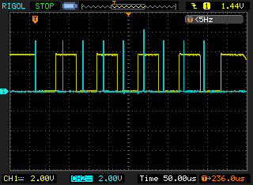
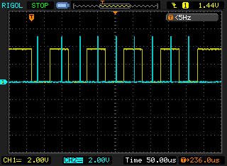

I don't find the code particularly clear.  I'd hoped that having the timer run at 3x the baud rate would allow for a "majority vote" during RX, emulating the operation of the hardware UART.  That's not the case, however.

For RX, the various bits of counting down from 4 appears to just (roughly) center the next read in the middle of the bit being received.

  
  
Receiving 0x55 ('U') at 19200 baud.  Channel 2 is toggled high for about 1.5µs, while the RX line is sampled and processed.  